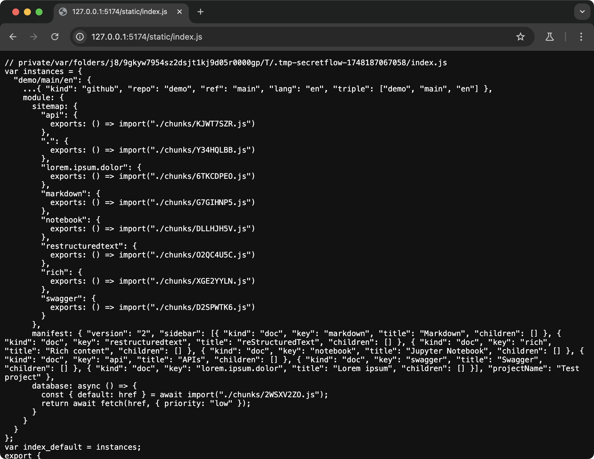

# Contributing <!-- omit from toc -->

- [Prerequisites](#prerequisites)
- [Development](#development)
- [Installing dependencies](#installing-dependencies)
- [Running checks and tests](#running-checks-and-tests)
- [Building the Python CLI](#building-the-python-cli)
- [Building the JavaScript library](#building-the-javascript-library)
- [Starting the dev server](#starting-the-dev-server)
- [Topics](#topics)
  - [**Architecture**](#architecture)
  - [Sphinx projects](#sphinx-projects)
  - [**Sphinx builders**](#sphinx-builders)
  - [Docutils translators](#docutils-translators)
  - [**Pathfinding**](#pathfinding)
  - [reStructuredText](#restructuredtext)
  - [Markdown/MysT](#markdownmyst)
  - [Jupyter Notebooks](#jupyter-notebooks)
  - [**Multiple languages**](#multiple-languages)
  - [Swagger](#swagger)
  - [**Version tagging**](#version-tagging)
  - [**MDX, JSX, JavaScript**](#mdx-jsx-javascript)
  - [Images and attachments](#images-and-attachments)
  - [npm packages](#npm-packages)
  - [**Publishing docs**](#publishing-docs)
  - [Web application](#web-application)
  - [Routing and data loading](#routing-and-data-loading)
  - [Fetching from CDNs](#fetching-from-cdns)
  - [Localization](#localization)
  - [**Environment variables**](#environment-variables)

## Prerequisites

You will need the following:

- [uv]
- [Node] >= 20
- [pnpm] >= 10

Additionally, to be able to build Python packages, you will also need:

- [Deno] >= 2

> [!TIP]
>
> You can also [work on this project inside a container][devcontainer]. This project
> provides a [preconfigured devcontainer](./.devcontainer/devcontainer.json) which
> contains all required programs.

## Development

## Installing dependencies

```sh
pnpm run bootstrap
```

This will:

- Run `pnpm install` and install all Node dependencies;
- Run [`uv sync`] and install all Python dependencies.

> [!TIP]
>
> [uv] manages a [Python environment][venv] for you, so a system Python is not
> necessary.
>
> After installing dependencies, make sure to activate the environment by running:
>
> ```sh
> source .venv/bin/activate
> ```
>
> and [configure VS Code to use it][vscode-venv].

## Running checks and tests

To make sure everything is working, after installing dependencies, run:

```sh
pnpm nx ci
```

This will:

- Run all linters: [`eslint`], [`stylelint`], and [`ruff`];
- Run all type checkers: [`tsc`] and [`pyright`];
- Run all tests: [`playwright`].

> [!TIP]
>
> [Nx] is the task runner of choice. Every command required to develop, build, and test
> this project is defined in the [`project.json`](./project.json) file.

To run just the end-to-end tests, you can also run:

```sh
pnpm nx test
```

> [!IMPORTANT]
>
> Currently, the test suite make extensive use of [snapshot
> testing][playwright-screenshot].
>
> Because screenshot rendering varies by platform and browser, screenshot comparisons
> are only enabled on **Linux**. On other platforms, including **macOS** and
> **Windows**, screenshot tests are substituted with [ARIA snapshots][playwright-aria].
> You may see the remaining tests as skipped. To run screenshot tests on these
> platforms, [use the configured devcontainer][devcontainer], which runs Debian.
>
> Playwright runs multiple browsers at once. The test suite includes taking snapshots
> against production content. If tests are failing due to timeouts, make sure you have a
> good internet connection; alternatively, lower the amount of workers with the
> `--workers` option.

## Building the Python CLI

To build the CLI, run:

```sh
pnpm nx build:wheels
```

> [!IMPORTANT]
>
> [Deno] must be available for wheels to build.

This will:

- Build the [web application](src/js/browser/main.tsx) and the companion
  [JavaScript CLI script](src/js/deno/main.ts).
- Build the Python package into [tarballs][sdist] and [wheels][wheel]. These will appear
  in the [dist](dist) directory as `dist/*.tar.gz` and `dist/*.whl` files.

The resulting wheels are ready to be installed in another Python project, or uploaded to
PyPI.

> [!TIP]
>
> [Hatch] is the Python packager. Build configuration is in
> [`pyproject.toml`](./pyproject.toml), in the `[tool.hatch.build]` table.
>
> [Vite] is the bundler for the web application. Configuration is in
> [`vite.config.ts`](./vite.config.ts). The resulting static files is in
> [dist/web](dist/web) which are then bundled into
> [src/py/secretflow_doctools/js/web.tar](src/py/secretflow_doctools/js/web.tar).
>
> The JavaScript CLI script is first built using
> [scripts/build-cli.js](scripts/build-cli.js) and then built into standalone
> executables using [`deno compile`]. The resulting executable is packaged into the
> Python wheels. This is configured in
> [scripts/wheel_builder.py](scripts/wheel_builder.py).

## Building the JavaScript library

Besides the command line utility, this project provides the web application for
displaying docs in the form of a JavaScript library. To build this into an npm package,
run:

```sh
pnpm nx build:lib
pnpm pack
```

This will:

- Build the [JavaScript library](src/js/browser/lib.ts) into [dist/esm/](dist/esm/).
- Emit [TypeScript declarations][dts] into [dist/dts/](dist/dts/).
- Create an npm package which will appear as `./*.tgz`.

The resulting `.tgz` tarball is ready to be installed in another Node project, unzipped
into an [npm workspace] as a member package, or uploaded to npm.

> [!TIP]
>
> Configuration for building the library is in
> [`vite.config.lib.ts`](./vite.config.lib.ts).
>
> Note that the library is [**ESM-only**][esm].

## Starting the dev server

To work on the web application, run:

```sh
pnpm nx dev
```

This will:

- Build the [demo documentation](./tests/demo/conf.py).
- Start a [Flask] server at `http://127.0.0.1:5174` for the built docs.
- Start `vite dev` at `http://127.0.0.1:5173` for the web application.

You should be able to open <http://127.0.0.1:5173> and see the "Sitemap" page:

<figure>
  
</figure>

The dev server spawn script is [scripts/dev_server.py](scripts/dev_server.py).

> [!TIP]
>
> To see build output of the demo docs, see the
> [tests/demo/\_build/](tests/demo/_build/) directory. You can also open
> <http://127.0.0.1:5174/static/index.js>:
>
> <figure>
>   
> </figure>

## Topics

### **Architecture**

Roughly speaking, the workflow enabled by this project is as follows:

1. `secretflow_doctools` works with any (properly-configured)
   [Sphinx-based documentation](#sphinx-projects).
2. Documentation source is built first into
   [MDX and then into JavaScript](#mdx-jsx-javascript) files.
3. The JavaScript files is packaged into [npm packages](#npm-packages) (with
   `package.json` and everything).
4. The npm package is [published](#publishing-docs) to the public npm registry.
5. `@secretflow/doctools`, the React-based [web application](#web-application), loads
   published documentation from npm, and then display them.

> [!TIP]
>
> This project is much more complicated than it needs to be.

### Sphinx projects

`secretflow-doctools` works with [Sphinx]-based documentation projects. [Many
open-source projects][sphinx-examples], including [Python][sphinx-python], use Sphinx.

An example Sphinx project, located at [tests/demo](./tests/demo), is included for
development and testing.

Every Sphinx project has a [`conf.py`] file that configures the building process. To
enable doctools, add `"secretflow_doctools"` to the `extensions` list:

```diff
  extensions = [
+     "secretflow_doctools"
  ]
```

This causes Sphinx to invoke
[`secretflow_doctools.__init__:setup(app)`](src/py/secretflow_doctools/__init__.py#L1-L19),
which will register the MDX [builder](#sphinx-builders).

> [!TIP]
>
> For an example `conf.py` file, see the one in the
> [test project](./tests/demo/conf.py).
>
> Other notable Sphinx extensions include:
>
> - [`myst-parser`] — Enables [Markdown](#markdownmyst) as documentation source (the
>   default markup language would otherwise be [reStructuredText](#restructuredtext)).
> - [`myst-nb`] — Enables using [Jupyter Notebooks](#jupyter-notebooks) as documentation
>   source.
> - [`sphinx.ext.autodoc`] — Generate documentation from Python modules, functions, and
>   classes.

### **Sphinx builders**

`Builder` is Sphinx's main lifecycle interface responsible for finding and emitting
docs.

<figure>
  
  <figcaption>
    "Call graph for the standard Sphinx build workflow"<br>
    From <a href="https://www.sphinx-doc.org/en/master/extdev/builderapi.html">Builder API</a>
  </figcaption>
</figure>

The default builder is the [HTML builder][StandaloneHTMLBuilder], which emits static
HTML sites.

`secretflow-doctools` implements the [MDX](#mdx-jsx-javascript) builder, which emits
files in MDX instead. It is implemented in
[src/py/secretflow_doctools/builder.py](src/py/secretflow_doctools/builder.py).

### Docutils translators

`Translator`s are responsible for reading and writing individual documents. In a
nutshell, it is a [visitor] interface for the [docutils syntax tree][doctree] (which
Sphinx will parse files into for you).

> [!NOTE]
>
> Note that this is about converting syntax trees, not translating between human
> languages, which is covered in [Multiple languages](#multiple-languages) instead.

For example, the Markdown paragraph:

```md
The quick brown fox **jumps** over the lazy dog.
```

is parsed and represented as:

```xml
<paragraph>
  The quick brown fox <strong>jumps</strong> over the lazy dog.
</paragraph>
```

A `Translator` that handles such content would then have the interface:

```py
class Translator:
    def visit_paragraph(self, node):
        ...
    def depart_paragraph(self, node):
        ...
    def visit_strong(self, node):
        ...
    def depart_strong(self, node):
        ...
    def visit_Text(self, node):
        ...
    def depart_Text(self, node):
        ...
```

`secretflow-doctools` implements `MdxTranslator`, which transcribes a Docutils tree into
an [MDX](#mdx-jsx-javascript) tree. It is implemented in
[src/py/secretflow_doctools/translator.py](src/py/secretflow_doctools/translator.py).

> [!TIP]
>
> You can build a Sphinx project into syntax trees in XML using the `xml` builder:
>
> ```sh
> python -m sphinx --builder xml tests/demo tests/demo/_build/xml
> ```

### **Pathfinding**

There will be many files associated with each source file throughout the building
process. **There is a 1-to-1 correspondence between original source paths and generated
paths.**

Using the
[SecretFlow v1.12.0b0 → getting_started/deployment](https://github.com/secretflow/secretflow/blob/v1.12.0b0/docs/getting_started/deployment.md?plain=1)
page as an example:

| File type                          | File path                                                                                                                                                                                                                                      |
| ---------------------------------- | ---------------------------------------------------------------------------------------------------------------------------------------------------------------------------------------------------------------------------------------------- |
| Source file                        | <a href="https://github.com/secretflow/secretflow/blob/v1.12.0b0/docs/getting_started/deployment.md?plain=1"><code>docs/<strong>getting_started/deployment.md</strong></code></a>                                                              |
| [Translation](#multiple-languages) | <a href="https://github.com/secretflow/secretflow/blob/v1.12.0b0/docs/locales/zh_CN/LC_MESSAGES/getting_started/deployment.po"><code>docs/locales/<strong>zh_CN</strong>/LC_MESSAGES/<strong>getting_started/deployment.po</strong></code></a> |
| [MDX output](#mdx-jsx-javascript)  | <code>docs/\_build/mdx/<strong>secretflow/v1.12.0b0/zh-CN/getting_started/deployment.mdx</strong></code>                                                                                                                                       |
| Web page                           | <a href="https://www.secretflow.org.cn/zh-CN/docs/secretflow/v1.12.0b0/getting_started/deployment"><code><strong>zh-CN</strong>/docs/<strong>secretflow/v1.12.0b0/getting_started/deployment</strong></code></a>                               |

Notable exceptions are:

- Sphinx/gettext accepts language tags with underscores (such as `zh_CN`). Page output
  and website URLs will replace underscores with dashes (such as `zh-CN`), which
  conforms to [BCP 47 (RFC 5646)][rfc5646].

- Pages with the name `index` (`**/index.rst`, `**/index.md`, and `**/index.ipynb`) will
  result in paths on the website _without_ the `/index` part, **but other generated
  files will still have `index.*` as their names**, that is:

  | File type   | File path                  |
  | ----------- | -------------------------- |
  | Source file | `path/to/folder/index.md`  |
  | Translation | `path/to/folder/index.po`  |
  | MDX output  | `path/to/folder/index.mdx` |
  | Web page    | `path/to/folder`           |

> [!TIP]
>
> The `repo/version/language` combination is internally termed a "target triple", which
> uniquely identifies a specific instance of documentation. In the source code, values
> referring to document versions are usually assigned the variable `ref`, and values
> referring to language codes are usually assigned the variable `lang`.
>
> Note that docs built into a second language are usually considered separate instances,
> because Sphinx must reparse source files for each language, and also projects are not
> required to support all languages.

> [!TIP]
>
> See also the [Publishing](#publishing-docs) section, which provides additional
> examples in terms of what files are eventually published.

### reStructuredText

Sphinx's default markup language is _reStructuredText_.

See ["reStructuredText Primer"][reStructuredText] in Sphinx's documentation for an
in-depth overview.

|        | Example document                                                                                                      |
| ------ | --------------------------------------------------------------------------------------------------------------------- |
| Source | <https://github.com/secretflow/secretflow/blob/v1.12.0b0/docs/user_guide/mpc_ml/generalized_linear_model.rst?plain=1> |
| Output | <https://www.secretflow.org.cn/en/docs/secretflow/v1.12.0b0/user_guide/mpc_ml/generalized_linear_model>               |

### Markdown/MysT

The [`myst-parser`] extension enables using Markdown as the markup language.

Note that the Markdown variant is MyST, which is "a strict superset of the [CommonMark
syntax specification][commonmark]".

See `myst-parser`'s documentation for guides on [syntax, features][myst-syntax], and
[configuration][myst-config].

|        | Example document                                                                                |
| ------ | ----------------------------------------------------------------------------------------------- |
| Source | <https://github.com/secretflow/kuscia/blob/v0.15.0b1/docs/reference/apis/summary_cn.md?plain=1> |
| Output | <https://www.secretflow.org.cn/zh-CN/docs/kuscia/v0.15.0b0/reference/apis/summary_cn>           |

### Jupyter Notebooks

The [`myst-nb`] extension enables using [Jupyter Notebooks][jupyter] as documentation
pages.

See `myst-nb`'s documentation for [configuration][myst-nb-config] options.

|        | Example document                                                                  |
| ------ | --------------------------------------------------------------------------------- |
| Source | <https://github.com/secretflow/spu/blob/0.9.3b0/docs/tutorials/quick_start.ipynb> |
| Output | <https://www.secretflow.org.cn/en/docs/spu/0.9.3b0/tutorials/quick_start>         |

> [!TIP]
>
> Enabling `myst-nb` will also implicitly enable [`myst-parser`](#markdownmyst). Specify
> either in the `extensions` list, but not both. If building docs fails with:
>
> ```
> WARNING: while setting up extension myst_nb: role 'sub-ref' is already registered, it will be overridden [app.add_role]
> WARNING: while setting up extension myst_nb: directive 'figure-md' is already registered, it will be overridden [app.add_directive]
>
> Traceback (most recent call last): ...
> ```
>
> then you have enabled both, remove `myst_parser` from `extensions`:
>
> ```diff
>   extensions = [
> -   "myst_parser",
>     "myst_nb",
>   ]
> ```

> [!NOTE]
>
> Previous versions of `secretflow-doctools` also accept syntax trees produced by
> [`nbsphinx`]. **`nbsphinx` is no longer supported as of version `0.8.0`**, and
> notebook cells will not have the correct appearance when it is used (although there
> will be no errors).
>
> `nbsphinx` is discouraged because it has an external dependency ([pandoc]) and has
> idiosyncrasies in terms of translation handling.

### **Multiple languages**

Sphinx uses [GNU gettext][gettext] for translating source documents into other
languages.

Translation files (PO files) have suffix `.po` and are placed under
`docs/locales/<language>/LC_MESSAGES/`, where `<language>` is the target language, such
as `en` or `zh_CN`. An example PO file would be:

```
msgid "Hello, world!"
msgstr "你好，世界！"
```

where `msgid` is the extracted original text and `msgstr` is the translated text.

`sphinx-intl` is a command line utility for extracting and updating PO files.
`secretflow-doctools` provides an `update-translations` command that automates it. It is
implemented in
[src/py/secretflow_doctools/cmd/update_translations.py](src/py/secretflow_doctools/cmd/update_translations.py).

For more information about PO files, see the [GNU gettext manual][gettext-po].

> [!TIP]
>
> Messages extracted by `sphinx-intl` may contain inline markups if the original text
> contains them. **Translations must use the same markup syntax as the original text.**
> A common pitfall is when the original text is in reStructuredText but the translation
> uses Markdown, for example:
>
> ```diff
>   msgid "This is a `link <https://example.org/>`_."
> - msgstr "这是一个 [链接](https://example.org/) 。"
> + msgstr "这是一个 `链接 <https://example.org/>`_ 。"
> ```

### Swagger

`secretflow-doctools` supports rendering [Swagger/OpenAPI] documents. The
[builder](#sphinx-builders) will look for code blocks with a `swagger` language tag and
render their content with a dedicated API viewer.

|        | Example document                                                                        |
| ------ | --------------------------------------------------------------------------------------- |
| Source | <https://github.com/secretflow/scql/blob/0.9.3b1/docs/reference/broker-api.rst?plain=1> |
| Output | <https://www.secretflow.org.cn/zh-CN/docs/scql/0.9.3b1/reference/broker-api>            |

### **Version tagging**

For versioned documentation, `secretflow-doctools` determines the version number to use
at build time using the checked-out ("current") commit and
[`git describe`][git-describe]. The implementation is in
[src/py/secretflow_doctools/vcs.py:git_describe](src/py/secretflow_doctools/vcs.py#L94).
Roughly speaking, the implementation tries the following in order:

1. If the current commit corresponds exactly to a git tag, the build with have that
   version. Otherwise,
2. If the current branch has a name that starts with `release/` (i.e. a release branch),
   it will look for the most recent tagged commit, [up to a merge commit][first-parent].
   If a tag is found, the build with have that version. Otherwise,
3. If the current branch is `main` or `master`, the version will be `"main"`. Otherwise,
4. The build will use the current branch name as the version name, with `/` replaced
   with `-`.
   - **[Publishing](#publishing-docs) will fail in this case.**

> [!IMPORTANT]
>
> - The current implementation uses `git describe`. This means tags and branches must
>   exist **locally** for this to work. In CI, make sure to fetch all necessary tags and
>   branches.
> - Due to architectural limitations, tag names must additionally conform to [PEP
>   440][pep440-examples] (although not necessarily semver) to appear on the website
>   correctly.

> [!TIP]
>
> Using a `release/` branch allows a published and tagged documentation to be later
> updated while keeping the same tag.

#### Example cases <!-- omit from toc -->

> `d0db94f` will result in version `main`:
>
> ```
> * d0db94f (HEAD -> main) docs: init
> * b613ced init
> ```

> `6372f79` will result in version `v0.1.0`:
>
> ```
> * 6372f79 (HEAD -> main, tag: v0.1.0) chore: release 0.1.0
> * d0db94f docs: init
> * b613ced init
> ```

> `8d90736` will result in version `main` because it is one commit after `v0.1.0`:
>
> ```
> * 8d90736 (HEAD -> main) fix: #1
> * 6372f79 (tag: v0.1.0) chore: release 0.1.0
> * d0db94f docs: init
> * b613ced init
> ```

> `6079634` will result in version `v0.1.0` because it is on branch `release/v0.1` which
> has `v0.1.0` in its history.
>
> ```
> * 6079634 (HEAD -> release/v0.1) fix: #2
> | * 8d90736 (main) fix: #1
> |/
> * 6372f79 (tag: v0.1.0) chore: release 0.1.0
> * d0db94f docs: init
> * b613ced init
> ```

> `510beaf` will result in `v0.1.0.post1`.
>
> ```
> * 510beaf (HEAD -> release/v0.1, tag: v0.1.0.post1) fix: #3
> * 6079634 fix: #2
> | * 8d90736 (main) fix: #1
> |/
> * 6372f79 (tag: v0.1.0) chore: release 0.1.0
> * d0db94f docs: init
> * b613ced init
> ```

### **MDX, JSX, JavaScript**

[MDX][mdx] is Markdown with syntax support for JSX markups.

[**unified**][unified.js], the libraries behind MDX, also has a
[visitor/transformer][unified-visitor] architecture that allows manipulating [Markdown
syntax trees][mdast], as well as tooling to [compile][`@mdx-js/mdx`] MDX documents into
plain JavaScript.

`secretflow-doctools` builds Sphinx documentation into MDX files with JSX markup. The
[web application](#web-application) then provides the React components at runtime. This
separation allows page appearances and functionalities to be iterated on without always
requiring the build output to change or old docs to be rebuilt.

For example, the [Swagger](#swagger) feature is implemented as follows:

1. In the source document, you have:

   ````md
   # API Documentation

   ```swagger
   swagger: "2.0"
   paths:
     /api/v1/foo/bar:
       ...
   ```
   ````

2. In [translator.py](src/py/secretflow_doctools/translator.py), the document is
   represented in memory as:

   ```py
   {
     "type": "root",
     "children": [
       {
         "type": "heading",
         "depth": 1,
         "children": [
           {
             "type": "text",
             "value": "API Documentation"
           }
         ]
       },
       {
         "type": "code",
         "lang": "swagger",
         "value": "swagger: \"2.0\"\npaths:\n  /api/v1/foo/bar:\n    ..."
       }
     ]
   }
   ```

3. The [`remark-swagger`](src/js/mdx/remark-swagger.ts) plugin (implemented in
   JavaScript) transforms this into:

   ```json
   {
     "type": "root",
     "children": [
       {
         "type": "heading"
         // ...
       },
       {
         "type": "mdxJsxFlowElement",
         "name": "OpenAPIViewer",
         "attributes": [
           {
             "type": "mdxJsxAttribute",
             "name": "schema",
             "value": {
               "type": "mdxJsxAttributeValueExpression",
               "value": "`swagger: \"2.0\"\\npaths: ...`"
             }
           }
         ],
         "children": []
       }
     ]
   }
   ```

   which, if emitted as MDX, becomes:

   ```mdx
   # API Documentation

   <OpenAPIViewer schema={`swagger: "2.0"\npaths: ...`} />
   ```

4. [deno/bundle.ts](src/js/deno/bundle.ts) compiles this into plain JavaScript, which is
   approximately:

   ```js
   export default function MDXContent(props) {
     const { jsx, OpenAPIViewer } = props;
     return jsx(OpenAPIViewer, {
       schema: `swagger: "2.0"\npaths: ...`,
     });
   }
   ```

5. The `OpenAPIViewer` component is then injected at runtime, in
   [browser/page/index.tsx](src/js/browser/page/index.tsx). The component is currently
   implemented in
   [openapi/OpenAPIViewer.tsx](src/js/browser/page/components/OpenAPI/components/openapi/OpenAPIViewer.tsx).

> [!TIP]
>
> #### Further reading
>
> - [MDX Docs][mdx]
>   - [MDX Playground][mdx-playground]
>   - [`@mdx-js/mdx`] — the MDX compiler
> - [unified.js]
>   - [remark] — the Markdown processor subsystem
>   - [mdast] — the Markdown syntax tree
>
> #### Relevant source code
>
> - src/py/secretflow_doctools/
>   - [markdown/](src/py/secretflow_doctools/markdown) contains most of logic pertaining
>     to MDX handling on the Python side.
> - src/js/
>   - [browser/page/](src/js/browser/page) contains all client-side (runtime) React
>     components.
>   - [mdx/](src/js/mdx) contains all unified.js transformers used in this project.
>   - [deno/ffi.ts](src/js/deno/ffi.ts) provides certain interfaces ("FFI") that the
>     Python extension will call into (via HTTP) during Sphinx's building process, this
>     is currently used for things like parsing and processing raw HTML in Markdown
>     sources.
>   - [deno/bundle.ts](src/js/deno/bundle.ts) implements the compiler that eventually
>     outputs documentation as an npm package (see the [next chapter](#npm-packages)).

### Images and attachments

In addition to text content, the build process must correctly find and copy all media
files linked in the documentation, such as images and downloads.

During the MDX building phase, the builder transforms all markups that link external
files into ESM imports, so that esbuild will eventually be able to bundle everything
correctly. This is implemented in
[remark-esbuild-static.ts](src/js/mdx/remark-esbuild-static.ts).

For example, a Markdown image such as:

```md

```

becomes:

```mdx
import asset0 from "/path/to/media/grapefruit-slice.jpg";


```

which is then:

```js
import asset0 from "/path/to/media/grapefruit-slice.jpg";

export default function Content() {
  return jsx("img", {
    src: asset0,
    alt: "grapefruit",
  });
}
```

esbuild's [`file` loader][file-loader] then compiles this to:

```js
// path/to/_build/mdx/demo/main/en/_assets/grapefruit-slice.jpg
var asset0_default = "../assets/JSNXMC3L.jpg";

// asset-url-module:/path/to/_build/mdx/demo/main/en/_assets/grapefruit-slice.jpg.js
var asset0_jpg_default = new URL(asset0_default, import.meta.url).toString();

export default function Content() {
  return jsx("img", {
    src: asset0_jpg_default,
    alt: "grapefruit",
  });
}
```

where `new URL(asset0_default, import.meta.url)` will be the correct and
[publicly accessible](#publishing-docs) URL to the image at runtime.

> [!TIP]
>
> #### Further reading
>
> - [esbuild's `file` loader][file-loader]
> - [esbuild plugins][esbuild-plugins]
>
> #### Relevant source code
>
> - [remark-esbuild-static.ts](src/js/mdx/remark-esbuild-static.ts)

### npm packages

In the final phase of the building process, [MDX](#mdx-jsx-javascript) files are
[postprocessed](src/js/mdx/) and then [compiled][`@mdx-js/mdx`] into plain JavaScript
files. The end result of this step is an `index.js` file that serves as the entrypoint
and links every page together.

For example, the [demo project](tests/demo/) will output the following `index.js`,
annotated:

<figure>

```js
// private/var/folders/j8/9gkyw7954sz2dsjt1kj9d05r0000gp/T/.tmp-secretflow-1748308353419/index.js
var instances = {
  // the "target triple" that uniquely identifies each documentation instance
  "demo/main/en": {
    ...{
      kind: "github",
      repo: "demo",
      ref: "main",
      lang: "en",
      triple: ["demo", "main", "en"],
    },
    module: {
      // each entry is a page
      sitemap: {
        // this is the index page and corresponds to `docs/index.md`
        ".": {
          // the imported chunks are built by esbuild from each MDX file
          exports: () => import("./chunks/NW3WLWOM.js"),
        },
        // this corresponds to `docs/markdown.md`
        // this page would have a published URL that is:
        // https://example.org/en/docs/demo/main/markdown
        markdown: {
          exports: () => import("./chunks/PR6KUMMS.js"),
        },
        notebook: {
          exports: () => import("./chunks/2VG4UUCU.js"),
        },
        rich: {
          exports: () => import("./chunks/7G3QL6EQ.js"),
        },
        // ...
      },
      // this is metadata for the project
      manifest: {
        version: "2",
        // this is the navigation sidebar
        sidebar: [
          { kind: "doc", key: "markdown", title: "Markdown", children: [] },
          { kind: "doc", key: "rich", title: "Rich content", children: [] },
          { kind: "doc", key: "notebook", title: "Jupyter Notebook", children: [] },
          // ...
        ],
        projectName: "Test project",
      },
      // this resolves to the full-text search database
      database: async () => {
        const { default: href } = await import("./chunks/ZD2H6D3D.js");
        return await fetch(href, { priority: "low" });
      },
    },
  },
};
var index_default = instances;
export { index_default as default };
```

<figcaption>tests/demo/_build/esm/index.js</figcaption>

</figure>

> [!TIP]
>
> After compiling the [test project](tests/demo), you can find the emitted JavaScript
> files under [tests/demo/\_build/esm/](tests/demo/_build/esm/).
>
> #### Relevant source code
>
> - src/js/
>   - [deno/bundle.ts](src/js/deno/bundle.ts), which uses [esbuild], which is the
>     JavaScript bundler used under the hood.
>   - [deno/templates/index.js.hbs](src/js/deno/templates/index.js.hbs) is the
>     [Handlebars] template for the `index.js` file (seen above).

### **Publishing docs**

`secretflow-doctools` publishes built documentation to [npm]. The publish command is
implemented in [cmd/publish.py](src/py/secretflow_doctools/cmd/publish.py).

Publishing to npm makes content available to the public internet. The website
(<https://www.secretflow.org.cn>) is then able to load them from CDNs that provides
static file access to the registry.

As a final "pathfinding" example, the following table shows all addressable places and
identifiers of the document page
[SCQL 0.9.3b1 → Security overview](https://www.secretflow.org.cn/en/docs/scql/0.9.3b1/topics/security/overview):

|                                | SCQL 0.9.3b1 → Security overview                                                                             |
| ------------------------------ | ------------------------------------------------------------------------------------------------------------ |
| Source file                    | <https://github.com/secretflow/scql/blob/0.9.3b1/docs/topics/security/overview.rst>                          |
| PO file                        | <https://github.com/secretflow/scql/blob/0.9.3b1/docs/locales/zh_CN/LC_MESSAGES/topics/security/overview.po> |
| MDX output (local)             | `docs/_build/mdx/scql/0.9.3b1/en/topics/security/overview.mdx`                                               |
| Page module (local)            | `docs/_build/esm/chunks/TIMOEUX2.js` (content-hashed by esbuild)                                             |
| Entrypoint (local)             | `docs/_build/esm/index.js`                                                                                   |
| Git commit                     | <code><strong>bd33dae</strong>f0ce8c84889b37d8050989bab0b18a026</code>                                       |
| Git tag                        | <code><strong>0.9.3b1</strong></code>                                                                        |
| package.json `"name"`          | `@secretflow/x-scql`                                                                                         |
| package.json `"version"`       | <code>0.0.4-g<strong>bd33dae</strong>-b202503070338267683</code>                                             |
| npm [dist-tag]                 | <code>gh-<strong>0.9.3b1</strong></code>                                                                     |
| npm page                       | <https://www.npmjs.com/package/@secretflow/x-scql/v/gh-0.9.3b1>                                              |
| package.json (via [npmmirror]) | <https://registry.npmmirror.com/@secretflow/x-scql/gh-0.9.3b1/files/package.json>                            |
| Page module (via [npmmirror])  | <https://registry.npmmirror.com/@secretflow/x-scql/gh-0.9.3b1/files/dist/chunks/TIMOEUX2.js>                 |
| Page module (via [jsDelivr])   | <https://cdn.jsdelivr.net/npm/@secretflow/x-scql@gh-0.9.3b1/dist/chunks/TIMOEUX2.js>                         |
| Website                        | <https://www.secretflow.org.cn/en/docs/scql/0.9.3b1/topics/security/overview>                                |

### Web application

The web application is responsible for fetching and displaying built and/or published
documentation on a webpage. It is a Vite + React app that becomes:

- A client-side rendered static site that will be bundled with the Python package and
  enables users to preview documentation locally.
- A React component library, that is, a conformant npm package, that other React
  applications can integrate. This is used by <https://www.secretflow.org.cn>.

Source is in [src/js/browser/](src/js/browser/):

- [app.tsx](src/js/browser/app.tsx) contains the core
  [routing](#routing-and-data-loading) logic.
- [i18n.tsx](src/js/browser/i18n.tsx) contains logic related UI localization and
  language selection, both for the UI and for choosing the correct content to load.
- [loaders.ts](src/js/browser/loaders.ts) contains logic related to fetching content
  from CDNs.
- [theme.tsx](src/js/browser/theme.tsx) defines theme variables and related utilities.
- [layout/](src/js/browser/layout/) contains all components that make up the UI.
- [page/](src/js/browser/page/) contains all components that will be provided to the
  inner [MDX document](#mdx-jsx-javascript).

The entrypoints are:

- [main.tsx](src/js/browser/main.tsx) — the entrypoint when bundling for static site
  output (that will be included in the Python package). It contains logic specific to
  previewing docs locally.
- [lib.ts](src/js/browser/lib.ts) — the entrypoint when bundling in library mode.

### Routing and data loading

The web app uses [React Router][react-router]. The challenge:

Given that

- documentation versions are continuously updated, paths in which may also be changing,
  and that
- this project is a fully client-side application that currently loads content from CDNs
  instead of a dedicated, know-everything server,

it is impossible to have a routing table that is statically known at build time, without
having to frequently rebuild and redeploy the website itself.

React Router's solution to this is the [_Fog of War_][fog-of-war] strategy. In a
nutshell, the "table of content" of a specific doc version — that is, the
[`index.js` entrypoint](#npm-packages) generated when docs are built — is requested only
upon user navigation.

Precisely which package to retrieve is determined by the page URL alone. For example,
the pathname `/en/docs/scql/0.9.3b1/topics/security/overview`, when [matched][matchPath]
using the pattern `/:lang/docs/:repo/:ref/*`, results in:

|         |                            |
| ------- | -------------------------- |
| `:repo` | `scql`                     |
| `:ref`  | `0.9.3b1`                  |
| `:lang` | `en`                       |
| `*`     | `topics/security/overview` |

The npm package to load is then
[`@secretflow/x-scql` with dist-tag `gh-0.9.3b1`](https://www.npmjs.com/package/@secretflow/x-scql/v/gh-0.9.3b1).

This is implemented in
[app.tsx, in the `discoverContent` function](src/js/browser/app.tsx#L325).

> [!TIP]
>
> #### Further reading
>
> - [`patchRoutesOnNavigation`] (docs in react-router v6)

### Fetching from CDNs

[`npmLoader`](src/js/browser/loaders.ts#L77) implements logic for fetching
[published docs](#publishing-docs) from CDNs.

In [`discoverContent`](#routing-and-data-loading), after successfully matching
parameters from pathname:

1. The loader fetches the package's `package.json`, using a URL constructed from the
   parameters, for example:

   ```js
   let url = new URL("https://cdn.jsdelivr.net/npm/");
   url = new URL(`@secretflow/x-${repo}@${version}/`, url);
   url = new URL(file, url);
   return url;
   ```

   |         |                                                                           |
   | ------- | ------------------------------------------------------------------------- |
   | repo    | `scql`                                                                    |
   | version | `gh-0.9.3b1`                                                              |
   | file    | `package.json`                                                            |
   | url     | <https://cdn.jsdelivr.net/npm/@secretflow/x-scql@gh-0.9.3b1/package.json> |

2. The loader parses the `package.json` and extracts the path to the entrypoint:

   ```json
   {
     "version": "0.0.4-gbd33dae-b202503070338267683",
     "exports": {
       ".": {
         "import": "./dist/index.js",
         "default": "./dist/index.js"
       }
     }
   }
   ```

   ```js
   const pkg = packageJsonV1.parse(await response.json());

   const {
     version,
     exports: {
       ".": { import: file },
     },
   } = pkg;
   ```

3. The loader imports the entrypoint using [`import()`]:

   |         |                                                                                                    |
   | ------- | -------------------------------------------------------------------------------------------------- |
   | repo    | `scql`                                                                                             |
   | version | `0.0.4-gbd33dae-b202503070338267683`                                                               |
   | file    | `./dist/index.js`                                                                                  |
   | url     | <https://cdn.jsdelivr.net/npm/@secretflow/x-scql@0.0.4-gbd33dae-b202503070338267683/dist/index.js> |

   ```js
   const mod = await import(/* @vite-ignore */ /* webpackIgnore: true */ url);
   ```

> [!TIP]
>
> You can try this in [Deno] or in browser consoles and poke around:
>
> 

### Localization

#### Web application <!-- omit from toc -->

Translation of UI text in the React app is powered by [Lingui]. This project uses
English as the source language.

To indicate that a piece of JSX text requires translating, use the `<Trans />`
component:

```jsx
import { Trans } from "@lingui/react/macro";

return <Trans>Page loading ...</Trans>;
```

To indicate that a string requires translating, use the `t` function:

```js
import { useLingui } from "@lingui/react/macro";

const { t } = useLingui();
return t`Page loading ...`;
```

When your JavaScript code changes are ready, run:

```sh
pnpm nx lingui:extract
```

This will:

- Scan all JavaScript code for messages that may be added, updated, or deleted.
- Update the [PO files](#multiple-languages) under
  [src/js/browser/locales/](src/js/browser/locales/).

Then, you must update the PO files with your translations:

```diff
  msgid "Page loading ..."
- msgstr ""
+ msgstr "页面加载中 ..."
```

> [!TIP]
>
> Both the [`build:lib`](#building-the-javascript-library) and the
> [`build:wheels`](#building-the-python-cli) will run `lingui:extract` for you. If there
> are any outdated/untranslated messages, builds will fail. This ensures untranslated
> components do not accidentally end up in the final artifacts.
>
> Lingui has advanced and intuitive support for React, such as translating JSX elements
> that interpolate variables of have other JSX elements as children. See the [React
> tutorial][lingui-react] for more information.

#### Python package <!-- omit from toc -->

Translation of the Python CLI is powered by [Babel]. Translated are mostly logging
messages, shell prompts, and warnings.

To indicate that a string requires translating:

```py
from secretflow_doctools.l10n import gettext as _

_("pages built successfully")
```

When your Python code changes are ready, run:

```sh
pnpm nx babel:update
```

This will:

- Scan all Python code for messages that may be added, updated, or deleted.
- Update the [PO files](#multiple-languages) under
  [src/py/secretflow_doctools/locales/](src/py/secretflow_doctools/locales/).

Then, you must update the PO files with your translations:

```diff
  msgid "pages built successfully"
- msgstr ""
+ msgstr "文档构建成功"
```

### **Environment variables**

#### `nx dev` <!-- omit from toc -->

The dev server reads the following variables:

| Variable              | Usage                                                       | Defined in                                                                      |
| --------------------- | ----------------------------------------------------------- | ------------------------------------------------------------------------------- |
| `DOCTOOLS_CONFIG_DIR` | Serve built files from the specified Sphinx project         | [`cmd/preview.py:PreviewServerArgs`](src/py/secretflow_doctools/cmd/preview.py) |
| `VITE_SERVER_PORT`    | Port that the Vite dev server will use                      | [`vite.config.ts`](vite.config.ts)                                              |
| `FLASK_RUN_PORT`      | Port that the Flask app (which serves built files) will use | [Configuring from Environment Variables][flask-env]                             |

#### `nx publish:pypi` <!-- omit from toc -->

The `publish:pypi` command, which publishes [built wheels](#building-the-python-cli) to
PyPI, reads the following variables:

| Variable           | Usage      | Defined in                                             |
| ------------------ | ---------- | ------------------------------------------------------ |
| `HATCH_INDEX_AUTH` | PyPI token | [How to authenticate for index publishing][hatch-auth] |

#### `secretflow-doctools publish` <!-- omit from toc -->

The `secretflow-doctools publish` command, which
[publishes built documentation to npm](#publishing-docs), reads the following variables:

| Variable                     | Usage                                                     | Defined in                                                    |
| ---------------------------- | --------------------------------------------------------- | ------------------------------------------------------------- |
| `DRY_RUN`                    | `npm publish` will proceed **if and only if** `DRY_RUN=0` | [`cmd/publish.py`](src/py/secretflow_doctools/cmd/publish.py) |
| `DOCTOOLS_PUBLISH_NPM_TOKEN` | npm token                                                 | [`cmd/publish.py`](src/py/secretflow_doctools/cmd/publish.py) |

<!-- prettier-ignore-start -->

[`@mdx-js/mdx`]:              https://mdxjs.com/packages/mdx/
[`conf.py`]:                  https://www.sphinx-doc.org/en/master/usage/configuration.html
[`deno compile`]:             https://docs.deno.com/runtime/reference/cli/compile/
[`eslint`]:                   https://eslint.org/
[`import()`]:                 https://developer.mozilla.org/en-US/docs/Web/JavaScript/Reference/Operators/import
[`myst-nb`]:                  https://myst-nb.readthedocs.io/en/latest/
[`myst-parser`]:              https://myst-parser.readthedocs.io/en/latest/
[`nbsphinx`]:                 https://nbsphinx.readthedocs.io/en/0.9.7/
[`patchRoutesOnNavigation`]:  https://reactrouter.com/6.30.1/routers/create-browser-router#optspatchroutesonnavigation
[`playwright`]:               https://playwright.dev/
[`pyright`]:                  https://microsoft.github.io/pyright/
[`ruff`]:                     https://docs.astral.sh/ruff/
[`sphinx.ext.autodoc`]:       https://www.sphinx-doc.org/en/master/usage/extensions/autodoc.html
[`stylelint`]:                https://stylelint.io/
[`tsc`]:                      https://www.typescriptlang.org/
[`uv sync`]:                  https://docs.astral.sh/uv/concepts/projects/sync/#syncing-the-environment
[Babel]:                      https://babel.pocoo.org/en/latest/index.html
[commonmark]:                 https://spec.commonmark.org/0.31.2/
[Deno]:                       https://deno.com/
[devcontainer]:               https://code.visualstudio.com/docs/devcontainers/containers#_quick-start-open-an-existing-folder-in-a-container
[dist-tag]:                   https://docs.npmjs.com/cli/v11/commands/npm-dist-tag
[doctree]:                    https://docutils.sourceforge.io/docs/ref/doctree.html
[dts]:                        https://www.typescriptlang.org/tsconfig/#declaration
[esbuild-plugins]:            https://esbuild.github.io/plugins/#concepts
[esbuild]:                    https://esbuild.github.io/
[esm]:                        https://nodejs.org/api/esm.html#introduction
[file-loader]:                https://esbuild.github.io/content-types/#file
[first-parent]:               https://git-scm.com/docs/git-describe#Documentation/git-describe.txt---first-parent
[flask-env]:                  https://flask.palletsprojects.com/en/stable/config/#configuring-from-environment-variables
[Flask]:                      https://flask.palletsprojects.com/en/stable/
[fog-of-war]:                 https://remix.run/blog/fog-of-war
[gettext-po]:                 https://www.gnu.org/software/gettext/manual/html_node/PO-Files.html
[gettext]:                    https://www.gnu.org/software/gettext/
[git-describe]:               https://git-scm.com/docs/git-describe
[Handlebars]:                 https://handlebarsjs.com/
[hatch-auth]:                 https://hatch.pypa.io/1.13/how-to/publish/auth/
[Hatch]:                      https://hatch.pypa.io/latest/config/build/
[jsDelivr]:                   https://www.jsdelivr.com/
[jupyter]:                    https://docs.jupyter.org/en/latest/
[lingui-react]:               https://lingui.dev/tutorials/react#jsx-to-messageformat-transformations
[Lingui]:                     https://lingui.dev/introduction
[matchPath]:                  https://reactrouter.com/api/utils/matchPath#matchpath
[mdast]:                      https://github.com/syntax-tree/mdast
[mdx-playground]:             https://mdxjs.com/playground/
[mdx]:                        https://mdxjs.com/docs/
[myst-config]:                https://myst-parser.readthedocs.io/en/latest/configuration.html
[myst-nb-config]:             https://myst-nb.readthedocs.io/en/latest/configuration.html
[myst-syntax]:                https://myst-parser.readthedocs.io/en/latest/syntax/typography.html
[Node]:                       https://nodejs.org/
[npm workspace]:              https://docs.npmjs.com/cli/v11/using-npm/workspaces#defining-workspaces
[npm]:                        https://npmjs.com
[npmmirror]:                  https://npmmirror.com/
[Nx]:                         https://nx.dev/features/run-tasks
[pandoc]:                     https://pandoc.org/
[pep440-examples]:            https://packaging.python.org/en/latest/specifications/version-specifiers/#examples-of-compliant-version-schemes
[playwright-aria]:            https://playwright.dev/docs/aria-snapshots#aria-snapshots
[playwright-screenshot]:      https://playwright.dev/docs/test-snapshots
[pnpm]:                       https://pnpm.io/
[react-router]:               https://reactrouter.com/
[remark]:                     https://remark.js.org/
[reStructuredText]:           https://www.sphinx-doc.org/en/master/usage/restructuredtext/basics.html
[rfc5646]:                    https://datatracker.ietf.org/doc/rfc5646/
[sdist]:                      https://packaging.python.org/en/latest/specifications/source-distribution-format/
[sphinx-examples]:            https://www.sphinx-doc.org/en/master/examples.html
[sphinx-python]:              https://docs.python.org/3/
[Sphinx]:                     https://www.sphinx-doc.org/en/master/tutorial/index.html
[StandaloneHTMLBuilder]:      https://www.sphinx-doc.org/en/master/usage/builders/index.html#sphinx.builders.html.StandaloneHTMLBuilder
[Swagger/OpenAPI]:            https://swagger.io/specification/
[unified-visitor]:            https://unifiedjs.com/learn/recipe/tree-traversal/
[unified.js]:                 https://unifiedjs.com/learn/
[uv]:                         https://docs.astral.sh/uv/
[venv]:                       https://docs.astral.sh/uv/concepts/python-versions/#requesting-a-version
[visitor]:                    https://en.wikipedia.org/wiki/Visitor_pattern
[Vite]:                       https://vite.dev/
[vscode-venv]:                https://code.visualstudio.com/docs/python/environments#_select-and-activate-an-environment
[wheel]:                      https://packaging.python.org/en/latest/specifications/binary-distribution-format/

<!-- prettier-ignore-end -->
