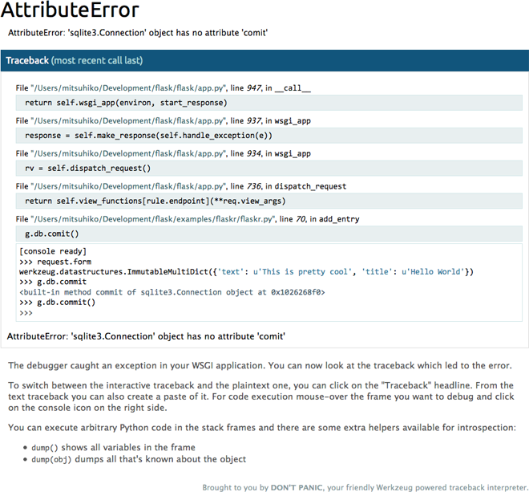

:target{id="module-werkzeug.debug"}

# Debugging Applications

Depending on the WSGI gateway/server, exceptions are handled
differently. Most of the time, exceptions go to stderr or the error log,
and a generic “500 Internal Server Error” message is displayed.

Since this is not the best debugging environment, Werkzeug provides a
WSGI middleware that renders nice tracebacks, optionally with an
interactive debug console to execute code in any frame.

<Container type="danger">
  The debugger allows the execution of arbitrary code which makes it a
  major security risk. <strong>The debugger must never be used on production
  machines. We cannot stress this enough. Do not enable the debugger
  in production.</strong>
</Container>

<Container type="note">
  The interactive debugger does not work in forking environments, such
  as a server that starts multiple processes. Most such environments
  are production servers, where the debugger should not be enabled
  anyway.
</Container>

:target{#enabling-the-debugger}

## Enabling the Debugger

Enable the debugger by wrapping the application with the
[`DebuggedApplication`](#werkzeug.debug.DebuggedApplication "werkzeug.debug.DebuggedApplication") middleware. Alternatively, you can pass
`use_debugger=True` to `run_simple()` and it will do that for you.

<Outline domain="py" objectType="class" target={"werkzeug.debug.DebuggedApplication"} module={"werkzeug.debug"} fullname={"DebuggedApplication"} parameters={["app", "evalex", "request_key", "console_path", "console_init_func", "show_hidden_frames", "pin_security", "pin_logging"]} description={"Enables debugging support for a given application:"}>
  <Outline.Signature fullname="DebuggedApplication" id="werkzeug.debug.DebuggedApplication">
    <Outline.Keyword>class<span>{" "}</span></Outline.Keyword><Outline.Prefix>werkzeug.debug.</Outline.Prefix><Outline.Name>DebuggedApplication</Outline.Name><Outline.ParameterList><span>(</span><Outline.Parameter><span className="name">app</span></Outline.Parameter>, <Outline.Parameter><span className="name">evalex</span><span>=</span><span>False</span></Outline.Parameter>, <Outline.Parameter><span className="name">request\_key</span><span>=</span><span>'werkzeug.request'</span></Outline.Parameter>, <Outline.Parameter><span className="name">console\_path</span><span>=</span><span>'/console'</span></Outline.Parameter>, <Outline.Parameter><span className="name">console\_init\_func</span><span>=</span><span>None</span></Outline.Parameter>, <Outline.Parameter><span className="name">show\_hidden\_frames</span><span>=</span><span>False</span></Outline.Parameter>, <Outline.Parameter><span className="name">pin\_security</span><span>=</span><span>True</span></Outline.Parameter>, <Outline.Parameter><span className="name">pin\_logging</span><span>=</span><span>True</span></Outline.Parameter><span>)</span></Outline.ParameterList>
  </Outline.Signature>

  <Outline.Content>
    Enables debugging support for a given application:

    ```default
    from werkzeug.debug import DebuggedApplication
    from myapp import app
    app = DebuggedApplication(app, evalex=True)
    ```

    The `evalex` argument allows evaluating expressions in any frame
    of a traceback. This works by preserving each frame with its local
    state. Some state, such as context globals, cannot be restored with
    the frame by default. When `evalex` is enabled,
    `environ["werkzeug.debug.preserve_context"]` will be a callable
    that takes a context manager, and can be called multiple times.
    Each context manager will be entered before evaluating code in the
    frame, then exited again, so they can perform setup and cleanup for
    each call.

    <FieldList>
      <dl>
        <dt className="field-name">
          Parameters
        </dt>

        <dd className="field-body">
          - <Outline.ParameterTarget>app</Outline.ParameterTarget> (<em>WSGIApplication</em>) – the WSGI application to run debugged.
          - <Outline.ParameterTarget>evalex</Outline.ParameterTarget> ([<em>bool</em>](https://docs.python.org/3/library/functions.html#bool "(in Python v3.11)")) – enable exception evaluation feature (interactive
            debugging).  This requires a non-forking server.
          - <Outline.ParameterTarget>request\_key</Outline.ParameterTarget> ([<em>str</em>](https://docs.python.org/3/library/stdtypes.html#str "(in Python v3.11)")) – The key that points to the request object in this
            environment.  This parameter is ignored in current
            versions.
          - <Outline.ParameterTarget>console\_path</Outline.ParameterTarget> ([<em>str</em>](https://docs.python.org/3/library/stdtypes.html#str "(in Python v3.11)")) – the URL for a general purpose console.
          - <Outline.ParameterTarget>console\_init\_func</Outline.ParameterTarget> (<em>t.Callable</em><em>\[</em><em>\[</em><em>]</em><em>, </em>[<em>dict</em>](https://docs.python.org/3/library/stdtypes.html#dict "(in Python v3.11)")<em>\[</em>[<em>str</em>](https://docs.python.org/3/library/stdtypes.html#str "(in Python v3.11)")<em>, </em><em>t.Any</em><em>]</em><em>] </em><em>| </em><em>None</em>) – the function that is executed before starting
            the general purpose console.  The return value
            is used as initial namespace.
          - <Outline.ParameterTarget>show\_hidden\_frames</Outline.ParameterTarget> ([<em>bool</em>](https://docs.python.org/3/library/functions.html#bool "(in Python v3.11)")) – by default hidden traceback frames are skipped.
            You can show them by setting this parameter
            to <cite>True</cite>.
          - <Outline.ParameterTarget>pin\_security</Outline.ParameterTarget> ([<em>bool</em>](https://docs.python.org/3/library/functions.html#bool "(in Python v3.11)")) – can be used to disable the pin based security system.
          - <Outline.ParameterTarget>pin\_logging</Outline.ParameterTarget> ([<em>bool</em>](https://docs.python.org/3/library/functions.html#bool "(in Python v3.11)")) – enables the logging of the pin system.
        </dd>
      </dl>
    </FieldList>

    <Container type="info" title="Version changed">
      <span>Changed in version 2.2: </span>Added the `werkzeug.debug.preserve_context` environ key.
    </Container>
  </Outline.Content>
</Outline>

:target{#using-the-debugger}

## Using the Debugger

Once enabled and an error happens during a request you will see a
detailed traceback instead of a generic “internal server error”. The
traceback is still output to the terminal as well.

The error message is displayed at the top. Clicking it jumps to the
bottom of the traceback. Frames that represent user code, as opposed to
built-ins or installed packages, are highlighted blue. Clicking a
frame will show more lines for context, clicking again will hide them.

If you have the `evalex` feature enabled you can get a console for
every frame in the traceback by hovering over a frame and clicking the
console icon that appears at the right. Once clicked a console opens
where you can execute Python code in:



Inside the interactive consoles you can execute any kind of Python code.
Unlike regular Python consoles the output of the object reprs is colored
and stripped to a reasonable size by default. If the output is longer
than what the console decides to display a small plus sign is added to
the repr and a click will expand the repr.

To display all variables that are defined in the current frame you can
use the `dump()` function. You can call it without arguments to get a
detailed list of all variables and their values, or with an object as
argument to get a detailed list of all the attributes it has.

:target{#debugger-pin}

## Debugger PIN

Starting with Werkzeug 0.11 the debug console is protected by a PIN.
This is a security helper to make it less likely for the debugger to be
exploited if you forget to disable it when deploying to production. The
PIN based authentication is enabled by default.

The first time a console is opened, a dialog will prompt for a PIN that
is printed to the command line. The PIN is generated in a stable way
that is specific to the project. An explicit PIN can be provided through
the environment variable `WERKZEUG_DEBUG_PIN`. This can be set to a
number and will become the PIN. This variable can also be set to the
value `off` to disable the PIN check entirely.

If an incorrect PIN is entered too many times the server needs to be
restarted.

<strong>This feature is not meant to entirely secure the debugger. It is
intended to make it harder for an attacker to exploit the debugger.
Never enable the debugger in production.</strong>

:target{#pasting-errors}

## Pasting Errors

If you click on the “Traceback (most recent call last)” header, the
view switches to a traditional text-based traceback. You can copy and
paste this in order to provide information when asking a question or
reporting an issue.
